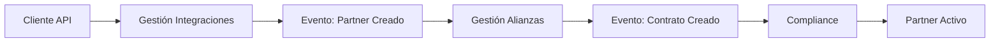

# AlpesPartners - Arquitectura de Microservicios Basada en Eventos

## Descripción del Proyecto

AlpesPartners es una plataforma de gestión de alianzas estratégicas implementada mediante una arquitectura de microservicios basada en eventos. El sistema maneja el ciclo completo desde la integración de partners hasta la ejecución de campañas, siguiendo los principios de Domain-Driven Design (DDD) y Event-Driven Architecture (EDA).

## Arquitectura del Sistema

### Microservicios Desarrollados

#### 1. Gestión de Integraciones `gestion-de-integraciones/`
**Responsabilidad**: Registro y gestión de partners externos
- **Tecnología**: Flask + SQLAlchemy
- **Base de Datos**: PostgreSQL (Puerto 5432)
- **API REST**: Puerto 5000
- **Funcionalidades**:
  - Creación de partners
  - Gestión de programas de afiliación
  - Validación de datos de integración

#### 2. Gestión Integral de Alianzas `gestion-de-alianzas/`
**Responsabilidad**: Administración de contratos y términos comerciales
- **Tecnología**: FastAPI + SQLAlchemy
- **Base de Datos**: PostgreSQL (Puerto 5435)
- **API REST**: Puerto 8000
- **Funcionalidades**:
  - Creación automática de contratos
  - Gestión de términos comerciales
  - Estados de contratos (Activo, Inactivo, Vencido)

#### 3. Administración Financiera y Compliance `compliance/`
**Responsabilidad**: Validación financiera y cumplimiento normativo
- **Tecnología**: Flask + SQLAlchemy
- **Base de Datos**: PostgreSQL (Puerto 5434)
- **API REST**: Puerto 5004
- **Funcionalidades**:
  - Alta de partners en sistema financiero
  - Validaciones de compliance
  - Reportes financieros

#### 4. Administración de Campañas `src/alpespartners`
**Responsabilidad**: Gestión de campañas de marketing
- **Estado**: Creacion de campañás

### Flujo de Integración de Partners



1. **Creación de Partner**: Cliente envía datos a Gestión de Integraciones vía API REST
2. **Evento de Integración**: Se genera evento `PartnerCreado` en Apache Pulsar
3. **Creación de Contrato**: Gestión de Alianzas recibe evento y crea contrato automáticamente
4. **Evento de Contrato**: Se genera evento `ContratoCreado` 
5. **Alta Financiera**: Compliance recibe evento y da de alta al partner en sistema financiero

## Decisiones Arquitectónicas

### 1. Comunicación Basada en Eventos

**Patrón Seleccionado**: Eventos de Integración con carga mínima de estado
- **Justificación**: Balance entre acoplamiento débil y eficiencia
- **Tecnología**: Apache Pulsar como message broker
- **Esquema de Eventos**: JSON con validación de esquemas

**Ejemplo de Evento**:
```json
{
  "eventType": "PartnerCreado",
  "timestamp": "2025-09-15T03:38:34Z",
  "partnerId": "uuid-123",
  "data": {
    "nombre": "Partner ABC",
    "tipo": "CORPORATIVO"
  }
}
```

## Decisión sobre Eventos y Esquemas

En este proyecto se optó por utilizar **eventos de integración con carga mínima de estado** en lugar de eventos con el estado completo de la entidad. Esta decisión se tomó para reducir el acoplamiento entre microservicios y facilitar la evolución independiente de cada contexto, permitiendo que cada servicio mantenga su propio modelo de datos y lógica de negocio. Los eventos transportan únicamente la información relevante para la integración, evitando exponer detalles internos innecesarios.

Para la serialización de eventos, se eligió **JSON** como formato inicial por su simplicidad, legibilidad y facilidad de integración con herramientas de desarrollo y debugging. Aunque tecnologías como **Avro** o **Protobuf** ofrecen ventajas en validación de esquemas y eficiencia, se consideró que para esta primera entrega la flexibilidad y rapidez de desarrollo de JSON es más conveniente. Sin embargo, la arquitectura está preparada para migrar a Avro o Protobuf en futuras iteraciones, especialmente si se requiere mayor performance, validación estricta o compatibilidad con un Schema Registry.

Respecto al **versionado de eventos (Event Stream Versioning)**, se sigue una estrategia de evolución controlada: los eventos incluyen un campo de versión y se documentan los cambios en los esquemas. Esto permite que los consumidores puedan adaptarse progresivamente a nuevas versiones sin romper la compatibilidad, facilitando la evolución del sistema a medida que crecen los requerimientos de negocio.

## TODO - diseño de los esquemas

---

## Patrones de Almacenamiento: CRUD vs Event Sourcing

Para el almacenamiento de datos en los microservicios, se ha optado por una estrategia híbrida que combina el modelo clásico **CRUD** y el patrón **Event Sourcing**, seleccionando el más adecuado según las necesidades de cada contexto.

- En los servicios de **Gestión de Integraciones** y **Compliance**, se utiliza un modelo CRUD tradicional, ya que estos dominios requieren operaciones directas y simples sobre los datos, priorizando la eficiencia en consultas y la facilidad de integración con herramientas estándar de bases de datos relacionales.

- En el servicio de **Gestión de Alianzas**, se está explorando el uso de Event Sourcing para el manejo de contratos, permitiendo registrar cada cambio como un evento inmutable. Esto facilita la trazabilidad, auditoría y reconstrucción del estado de los contratos a lo largo del tiempo, lo cual es valioso en escenarios donde la historia de cambios es crítica.

Esta combinación permite aprovechar las ventajas de ambos enfoques: la simplicidad y rendimiento del CRUD donde es suficiente, y la potencia de Event Sourcing donde la trazabilidad y la evolución del dominio lo requieren.

---

### 2. Patrones de Almacenamiento 

**Modelo Híbrido Implementado**:
- **CRUD Clásico**: Gestión de Integraciones, Compliance
  - Justificación: Operaciones simples, consultas directas
- **Event Sourcing**: Gestión de Alianzas (parcial)
  - Justificación: Trazabilidad de cambios en contratos
  - Implementación: Eventos de dominio + snapshots

### 3. Persistencia Descentralizada

Cada microservicio maneja su propia base de datos:
- **Gestión Integraciones**: PostgreSQL independiente
- **Gestión Alianzas**: PostgreSQL independiente  
- **Compliance**: PostgreSQL independiente
- **Ventajas**: Autonomía, escalabilidad independiente, tecnologías específicas

## Infraestructura y Despliegue

### Apache Pulsar Configuración Local
```yaml
services:
  zookeeper:
    image: apachepulsar/pulsar:3.2.4
    ports: ["2181:2181"]
  
  broker:
    image: apachepulsar/pulsar:3.2.4
    ports: ["6650:6650", "8081:8080"]
    
  bookkeeper:
    image: apachepulsar/pulsar:3.2.4
```

### Docker Compose Structure
```bash
# Levantar infraestructura base (Pulsar)
docker-compose -f docker-compose.pulsar.yml up -d

# Levantar microservicios
docker-compose up --build

# Servicios individuales
cd gestion-de-alianzas && docker-compose up --build
cd compliance && docker-compose up --build
```

### Tecnologías Utilizadas

- **Lenguaje**: Python 3.12
- **Frameworks Web**: Flask, FastAPI
- **ORM**: SQLAlchemy 2.0
- **Base de Datos**: PostgreSQL 16
- **Message Broker**: Apache Pulsar 3.2.4
- **Contenedores**: Docker + Docker Compose
- **Gestión de Dependencias**: uv

## APIs Disponibles

### Gestión de Integraciones (Puerto 5000)
```bash
POST /programas        
GET  /programas/{id} 
```

### Gestión de Alianzas (Puerto 8000)
```bash
POST /contratos          
GET  /contratos/{id}     
PUT  /contratos/{id}     
```

### Compliance (Puerto 5004)
```bash
GET  /health           
POST /partners/validate 
```

## Entrega Parcial - Cumplimiento de Requisitos

### Requisitos Completados (Entrega 4)

1. **Arquitectura de Microservicios Basada en Eventos**: 
   - 4 microservicios independientes
   - Comunicación asíncrona con Apache Pulsar

2. **Eventos de Integración con Carga Mínima**:
   - Esquema JSON definido
   - Eventos `PartnerCreado` y `ContratoCreado`

3. **Apache Pulsar como Message Broker**: 
   - Configuración con ZooKeeper y BookKeeper
   - Tópicos: `gestion-de-integraciones`, `administracion-financiera-compliance`

4. **Persistencia Descentralizada**:
   - Cada microservicio con su BD PostgreSQL
   - Puertos independientes

5. **Modelos CRUD y Event Sourcing**:
   - CRUD: Integraciones, Compliance
   - Event Sourcing: Alianzas (eventos de dominio)

6. **Despliegue con Docker**: 
   - Docker Compose para cada servicio
   - Configuración de redes y volúmenes


## Instalación y Ejecución

### Prerrequisitos
- Docker y Docker Compose
- Python 3.12+
- uv (gestor de dependencias)

### Ejecución Completa

```bash
# 1. Clonar repositorio
git clone <repository-url>
cd misw4406-14-desacopla2

# 2. Levantar Apache Pulsar
docker-compose -f docker-compose.pulsar.yml up -d

# 3. Verificar que Pulsar esté corriendo
docker ps | grep pulsar

# 4. Levantar servicios principales
docker-compose up --build

# 5. Levantar servicios adicionales
cd gestion-de-alianzas
docker-compose up --build -d

cd ../compliance  
docker-compose up --build -d
```

### Verificación de Servicios

```bash
# Health checks
curl http://34.111.239.116/health          # Gestión Integraciones
curl http://34.144.243.152/docs           # Gestión Alianzas (Swagger)
curl http://34.111.90.7/health        # Compliance

```

## Desarrollo Local

### Sin Docker

```bash
# Instalar dependencias
uv sync

# Configurar PYTHONPATH
export PYTHONPATH="./src"  # Linux/Mac
$env:PYTHONPATH=".\src"    # Windows PowerShell

# Ejecutar servicios individuales
uv run flask --app alpespartners.api run  # Puerto 5000
cd gestion-de-alianzas && uvicorn src.entrypoints.api.main:app --reload  # Puerto 8000
```

### Con Docker (Recomendado)

Usar los comandos de Docker Compose mostrados anteriormente.

## Contribuciones del Equipo

### Distribución de Actividades

- **Carlos Garcia**: Arquitectura base, configuración Pulsar y despliegue
- **Miguel Gomez**: Gestión de Alianzas (FastAPI), Docker Compose, eventos
- **Helvert Wiesner**: Compliance
- **Orlando Arnedo**: Gestión de Integraciones

### Commits y Pull Requests
Las contribuciones están registradas en el control de versiones con commits equitativos entre los miembros del equipo.

---

## Documentación Técnica

### Estructura DDD por Microservicio

Cada microservicio sigue la estructura DDD:

```
src/
├── domain/           # Entidades, Value Objects, Eventos
├── application/      # Use Cases, Comandos, Queries  
├── infrastructure/   # Repositorios, BD, Message Brokers
├── entrypoints/      # APIs REST, Consumidores de eventos
└── adapters/         # Adaptadores externos
```

### Eventos de Dominio Implementados

```python
# Ejemplo: PartnerCreado
@dataclass
class PartnerCreado:
    partner_id: str
    nombre: str
    tipo: TipoPartner
    timestamp: datetime
```

### Video de la entrega 4 
[entrega 4 desacoplados](https://youtu.be/u21-_RgLSeY)


### Entrega 5

#### Activar Infraestructura

  ##### Iniciar Apache Pulsar
  docker-compose -f docker-compose.pulsar.yml up

 ##### Gestión de Integraciones
 docker-compose up --build
 database: 5434
 servicio: 5001

##### Gestión de Alianzas
 docker-compose up --build
 database: 5435
 servicio: 5001

##### Compliance
 docker-compose up --build
 database: 5436
 servicio: 5004